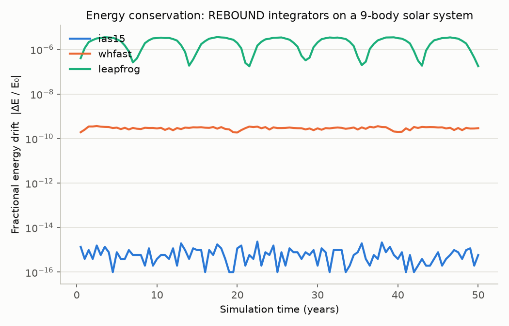

# Validation & Accuracy

This document summarizes how Astro Thesaurus's physics is validated, and how
to reproduce every number and figure below. It exists to support a paper
write-up: the "Methods" subsections map directly onto files in this repo, and
the "Results" subsections are generated artifacts, not hand-typed numbers.

## 1. Three independent validation layers

| Layer | What it checks | Code | Tests |
|---|---|---|---|
| Unit / analytic | Closed-form results (Kepler's 3rd law, vis-viva, Hohmann Δv) against textbook values | [`orbital_physics.py`](orbital_physics.py), [`physics_engine.py`](physics_engine.py) | [`tests/test_orbital_physics.py`](tests/test_orbital_physics.py), [`tests/test_physics_engine.py`](tests/test_physics_engine.py) |
| N-body integration | Energy/momentum conservation of the REBOUND wrapper across integrators | [`rebound_engine.py`](rebound_engine.py) | [`tests/test_rebound_engine.py`](tests/test_rebound_engine.py) |
| Ground-truth ephemeris | Simulated positions vs live NASA JPL Horizons data | [`orbital_accuracy.py`](orbital_accuracy.py) | [`tests/test_orbital_accuracy.py`](tests/test_orbital_accuracy.py) |

Run everything offline (no network, ~0.5s):
```bash
pytest -m "not network"
```
Run the Horizons-dependent ground-truth tests (needs internet, ~20s):
```bash
pytest -m network
```
CI (`.github/workflows/ci.yml`) runs the offline suite as a required gate on
every push, and the network suite as best-effort (Horizons access from CI
runners can be rate-limited).

## 2. Methodology

**Unit tests** check closed-form invariants that must hold regardless of
implementation: Earth's period is 1 year by construction of AU/yr/M☉ units,
escape velocity is exactly `√2 × v_circular`, binary orbital velocities
conserve momentum exactly, and the Hohmann Earth→Mars transfer matches the
textbook figures (Curtis, *Orbital Mechanics for Engineering Students*): a
~259-day transfer time and ~5.6 km/s combined heliocentric Δv.

**N-body tests** build a Sun+planet two-body scenario analytically (vis-viva
circular velocity) and assert REBOUND recovers the same semi-major axis,
eccentricity, and period the scenario was constructed from — then integrate
forward and check energy drift stays nearly at machine precision for `ias15`
and `whfast`. A dedicated regression test also confirms the accuracy
checker actually discriminates: a poorly-suited integrator (`leapfrog`) on a
highly eccentric orbit scores measurably worse than `ias15` on the identical
orbit — i.e. `orbital_accuracy.py` doesn't just always report "OK".

**Ground-truth tests** load real solar-system bodies from NASA JPL Horizons
via REBOUND's built-in fetcher and compare integrated positions against a
second, independent Horizons query at the simulated epoch (`predictive_accuracy()`
in `orbital_accuracy.py`). This is the strongest validation available without
a dedicated ephemeris library: it catches integration bugs that a two-body
closed-form check cannot, such as wrong body ordering, unit mismatches, or
incorrect center-of-mass handling.

## 3. Results — integrator energy conservation

Generated by [`benchmarks/integrator_comparison.py`](benchmarks/integrator_comparison.py),
fully offline and deterministic: a 9-body Sun + 8-planets system built from
the analytic elements in `physics_engine.SOLAR_SYSTEM` (each planet placed at
perihelion with its vis-viva perihelion speed), integrated for 50 years under
three REBOUND integrators.

```bash
python benchmarks/integrator_comparison.py
```



| Integrator | Final \|ΔE/E\| | Max \|ΔE/E\| | Wall time (s) |
|---|---|---|---|
| `ias15` | 5.9 × 10⁻¹⁶ | 2.4 × 10⁻¹⁵ | 0.17 |
| `whfast` | 2.9 × 10⁻¹⁰ | 3.6 × 10⁻¹⁰ | 0.02 |
| `leapfrog` | 1.8 × 10⁻⁷ | 3.6 × 10⁻⁶ | <0.01 |

(Regenerate with the command above — `benchmarks/results/energy_drift_data.csv`
holds the full sampled series and `benchmarks/results/summary.md` the same
table in Markdown.)

**Reading the figure:** `ias15` (adaptive Runge-Kutta) holds energy at
essentially double-precision floating-point noise (~10⁻¹⁶) for the full 50
years. `whfast` (symplectic, fixed-step) settles to a small, *bounded* drift
(~10⁻¹⁰) rather than growing — the expected symplectic signature: no secular
energy drift, only bounded oscillation. `leapfrog` (lowest-order symplectic)
shows the same bounded-oscillation character but roughly three orders of
magnitude worse, consistent with its lower integration order. This matches
the qualitative behavior described in the REBOUND paper (Rein & Liu 2012;
Rein & Tamayo 2015) and is why `websocket_server.py` defaults new scenarios
to `ias15` and only switches to `whfast` for long-duration, close-encounter-free
planetary systems (see `rebound_engine.INTEGRATOR_GUIDE`).

## 4. What this does *not* validate

- **Relativistic effects** (e.g. Mercury's perihelion precession) are absent
  from the Newtonian REBOUND integration — expected and out of scope.
- **Two-body approximations** (a scenario with only Sun+Earth, say) will
  measurably diverge from real Horizons ephemeris over time because they
  omit third-body perturbations (Jupiter, Venus, the Moon). This is
  demonstrated, not hidden, by
  `test_predictive_accuracy_reflects_two_body_approximation_error` in
  `tests/test_orbital_accuracy.py`.
- **AI-generated scenarios** (`ai_scenario_generator.py`) are validated only
  by `scenario_validator.py`'s velocity-bounds check, not against ground
  truth — there is no "correct answer" for an arbitrary hot-Jupiter prompt.
